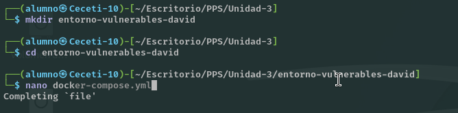

# PPS-Unidad3Actividad1-David

### Entorno de máquinas vulnerables.

Para ello tan sólo tenemos que realizar los siguientes pasos:

1. Crea una carpeta con nombre entorno-vulnerables-tunombre
2. Coloca dentro de ella el archivo docker-compose.yml que tienes en la carpeta entornoMaquinasInseguras de este repositorio:
3. Levanta el escenario multicontedor con docker-compose up -d.

#### DVWA

Comprobamos la máquina de DVWA buscado en el enlace http://locahost:8001.
Por lo tanto accedemos a ella en el enlace: localhost:8001.

Tendremos que crear y resetear la base de datos para interactuar con la máquina.
Hay un botón abajo que lo hace automáticamente.

#### BWAPP

A esta máquina accedemos a través del puerto 8002 http://localhost:8002/install.php.

Y ya podremos acceder pulsando en login o creando un nuevo usuario y eligiendo el nivel de seguridad que queramos tener en la máquina.

Esto sería el portal o la página principal del servicio web

#### OWASP Multillidae II

A esta máquina accedemos a través del puerto 80 o del 8080 http://localhost/database-offline.php.

Al igual que en los casos anteriores, el primer paso será crear la Base de Datos.

En este caso no necesitamos usuario y contraseña para acceder.

En multillidae tenemos además del servicio de BBDD otros servicios creados:

- Servicio PhpAdmin para acceder a las BBDD. Accedemos desde http://localhost:81. 

- Servicio PhpLdapAdmin para acceder al servicio de directorio LDAP. Accedemos desde http://localhost:82. 

### Entorno de pruebas.

Creamos un entorno de pruebas en los que vamos a realizar las prácticas, creando servidores y archivos con vulnerabiliades presentes, para corregirlas posteriormente.

En esta ocasión  crearemos un escenario multicontenedor con cualquiera de las pilas que nos podemos encontrar en docker hub. Yo he utilizado la primera que me he encontrado:https://github.com/sprintcube/docker-compose-lamp.git

Realizamos estos comandos:

Hay que cambiar los valores por defecto que nos proporciona en fichero sample.env.

Y activamos el docker compose con el comando : docker-compose up -d

